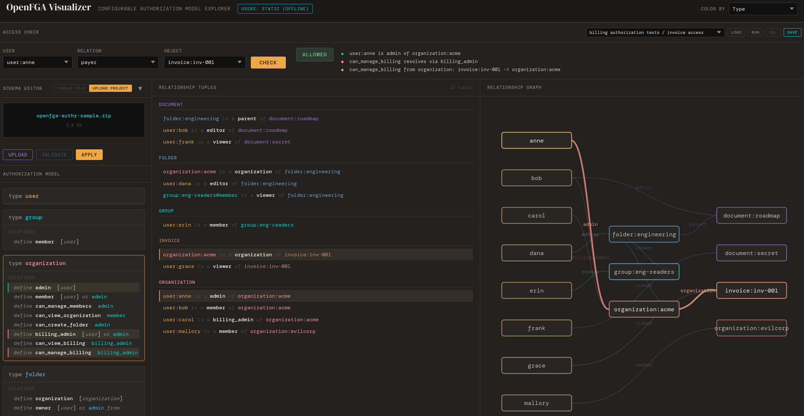

# OpenFGA Visualizer

Interactive authorization model explorer for OpenFGA. Renders type definitions, relationship tuples, and a graph view. With a browser based check engine for evaluating access queries and a test runner for project assertions.



## Quick Start

Open `index.html` in a browser for static mode, or run with Flask:

```
cp .env.sample .env
make start
```

The visualizer is available at `http://localhost:5090`.

## Modes

- **Static** -- open `index.html` directly or deploy to GitHub Pages. Edit JSON, run checks, upload project zips (parsed client-side).
- **Flask** -- serves live user data from Keycloak or LDAP. Adds fga CLI validation and server-side project parsing.

## Project Upload

Upload an OpenFGA project zip (with `fga.mod`, `.fga` modules, tuple/test YAML files). The model, tuples, and tests are extracted and rendered. Works in both static and Flask modes.
